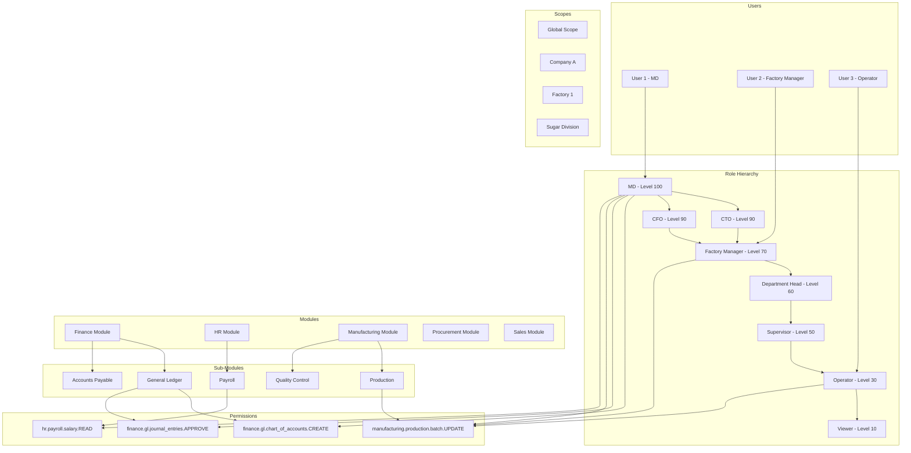
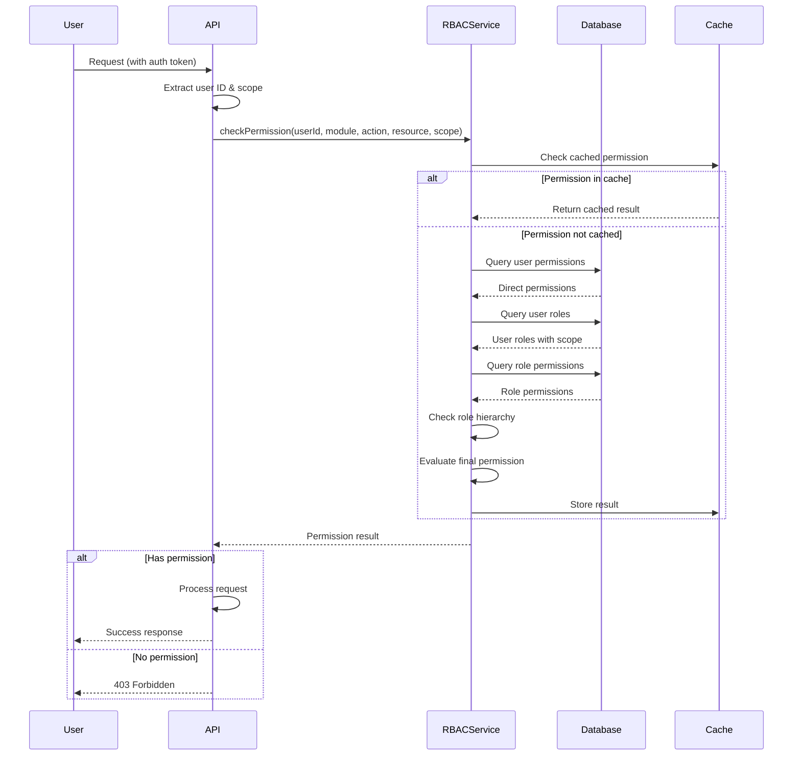
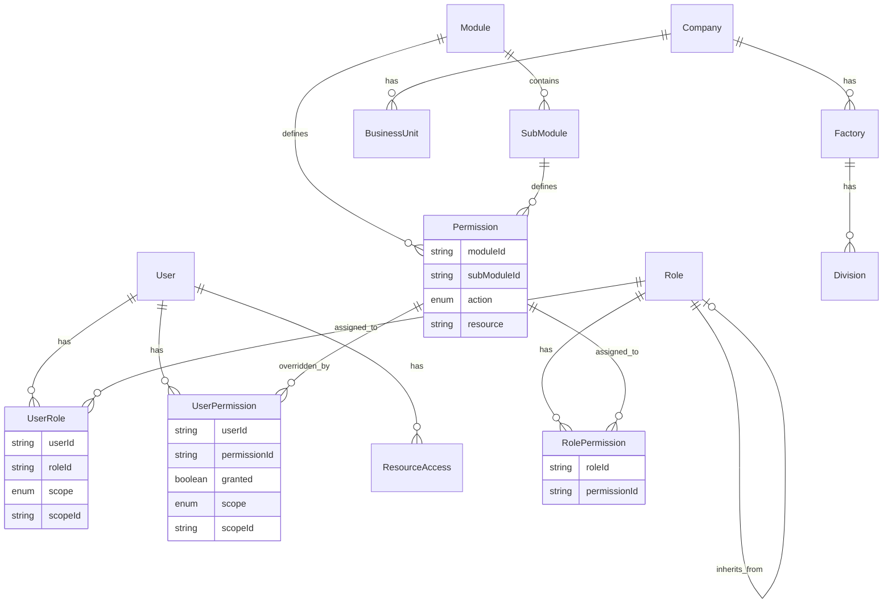
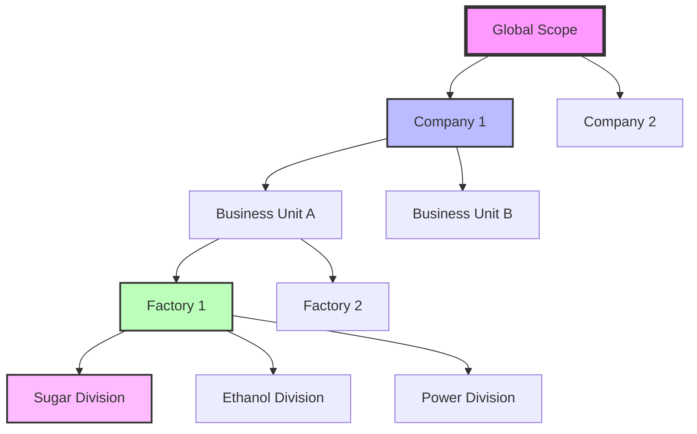
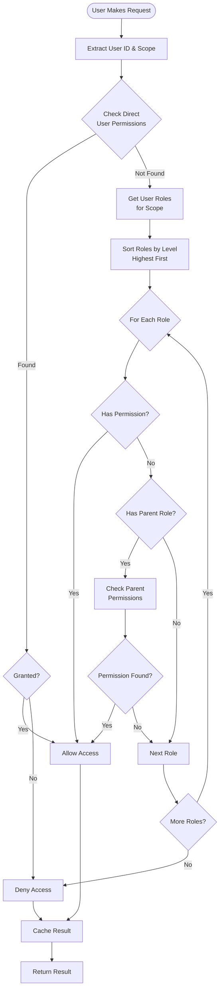

# RBAC Architecture Diagram

## System Overview



## Permission Flow



## Data Model Relationships



## Scope Hierarchy



## Permission Check Algorithm



## Example Permission Scenarios

### Scenario 1: MD Accessing Finance Module
```
User: MD (Managing Director)
Module: Finance
Action: APPROVE
Resource: journal_entries
Scope: Global

Result: ✅ Allowed (MD has all permissions globally)
```

### Scenario 2: Factory Manager Accessing Different Factory
```
User: Factory Manager
Module: Manufacturing  
Action: UPDATE
Resource: production_batch
Scope: Factory 2 (User assigned to Factory 1)

Result: ❌ Denied (No permission for Factory 2)
```

### Scenario 3: User with Override Permission
```
User: Operator
Module: Finance
Action: READ
Resource: reports
Normal Role Permission: ❌ No
User Override: ✅ Granted for specific factory

Result: ✅ Allowed (Override takes precedence)
```

## Implementation Priority

1. **Phase 1: Core RBAC**
   - Role model with hierarchy
   - Basic permissions
   - User-role assignments

2. **Phase 2: Scoped Access**
   - Company-level access
   - Factory-level access
   - Division-level access

3. **Phase 3: Advanced Features**
   - Permission overrides
   - Resource-based access
   - Business unit support

4. **Phase 4: Performance & Admin**
   - Permission caching
   - Admin UI
   - Audit logging